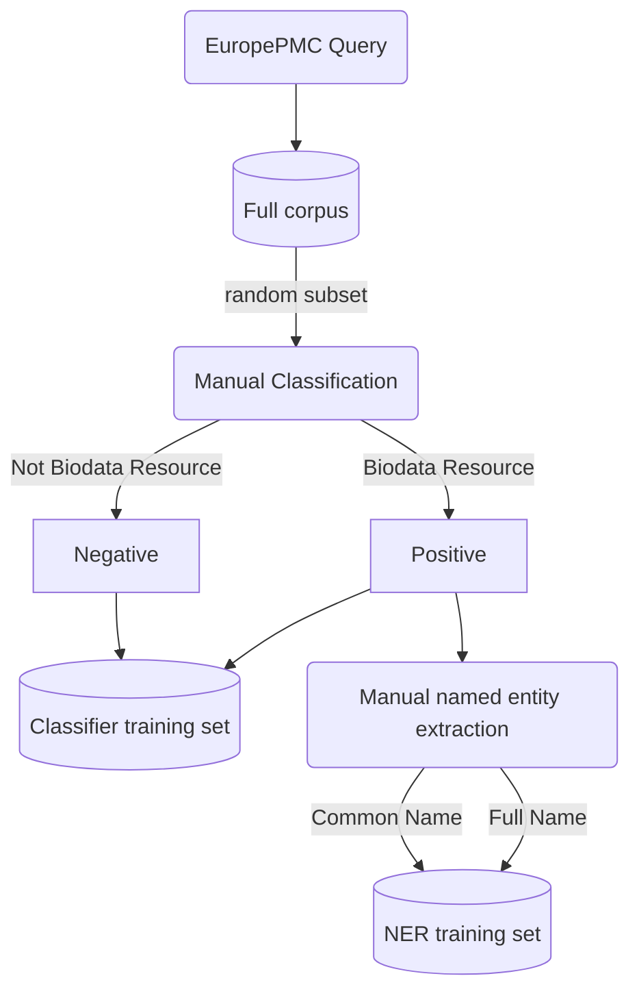
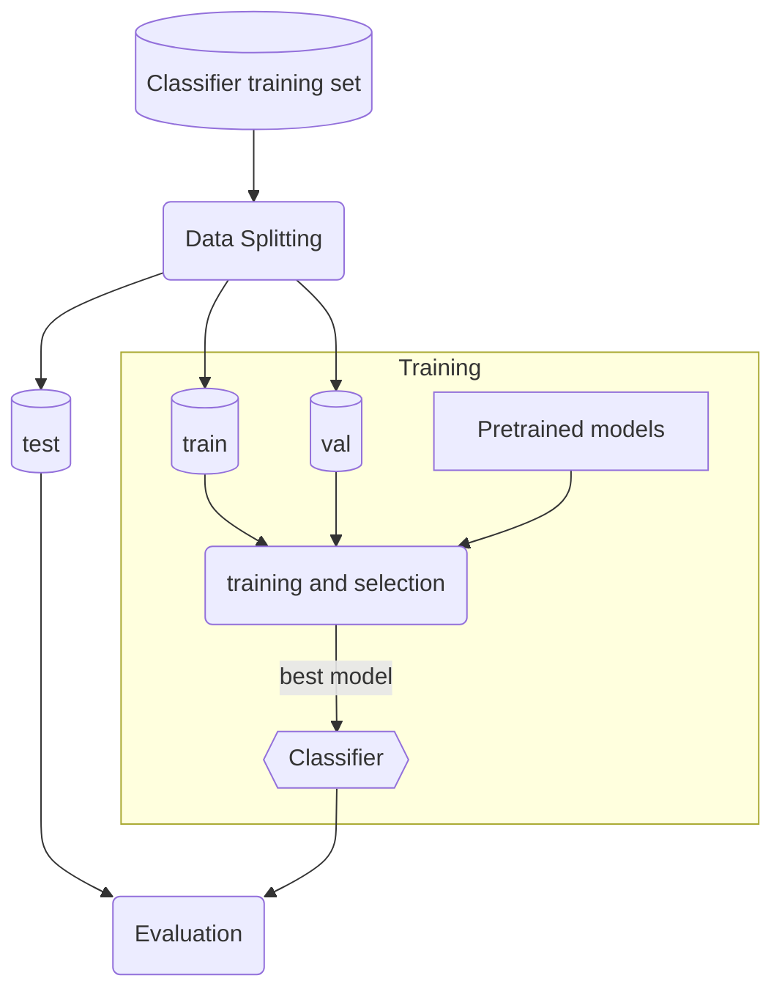
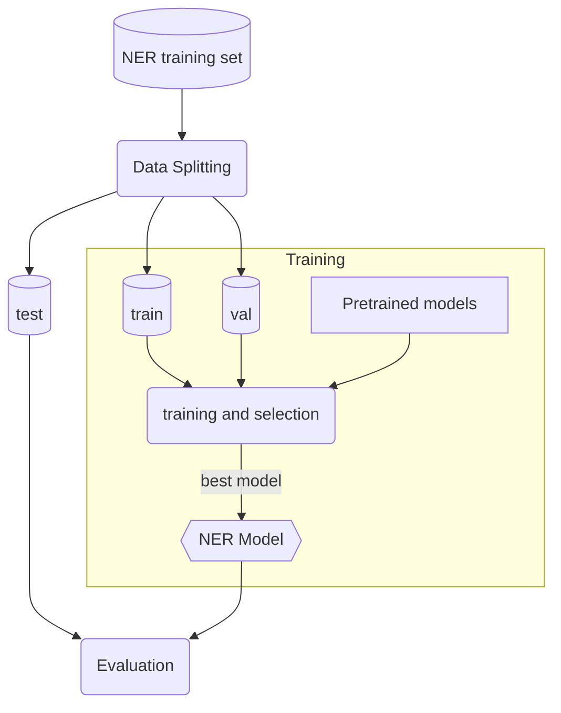
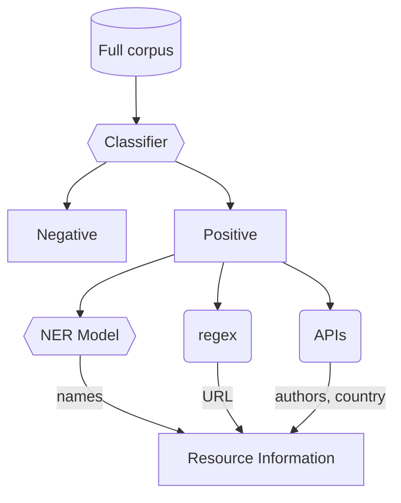

# inventory_2022 (Work in Progress)

This is a public repository of the code used for the Biodata Resource Inventory performed in 2022. This project is an effort by the [Global Biodata Coalition](https://globalbiodata.org/) to conduct a comprehensive inventory of the global infrastructure of biological data resources. A large portion of this effort is dedicated to being able to periodically update the inventory using the methods developed here.

To meet these goals, natural language processing (NLP) methods are applied to journal articles obtained from EuropePMC. First, articles are classified based on their titles and abstracts, to predict if they describe biodata resources. Then, of those articles that are predicted to describe biodata resources, named entity recognition (NER) is employed to predict the resource's name. Further metadata is gathered from the various fields obtained by querying EuropePMC. To aid in reproducibility and reuse, Snakemake pipelines were developed for automation of training, prediction, and updating the inventory.

# Contributions

This code repository represents work done as part of a collaborative effort between the Chan Zuckerberg Initiative (CZI) and Global Biodata Coalition (GBC) to create an inventory of biodata resources found in scientific articles. CZI Research Scientist Ana-Maria Istate designed the machine learning framework for the project and wrote the code to implement and evaluate the NLP models used to classify articles and extract individual resources. Ana’s code was used by GBC consultant Ken Schackart as the starting point for a pipeline to create an ML-predicted preliminary inventory, which is then further refined with code that includes steps for deduplication, processing for selective manual review, and augmentation with additional attributes to create the final inventory of biodata resources.

# Workflow overview

## Data curation

The manual curation has already been performed, using the full corpus obtained by querying EuropePMC. Titles and abstracts from ~1600 randomly selected papers were used for manual classification. This created the classifier training set. For those papers that were deemed to represent a biodata resource during manual curation, named entities were manually extracted from titles and abstracts, such as the reource name, URL, and description. This created the NER model training set.



## Classifier Training

The manually classified subset of the corpus is split into training, validation, and test (holdout) sets. Several pretrained BERT models are provided with the same training and validation data. The final classifier model is chosen based on the highest *F*1 score on the validation set. This is the classifier used in the final inventory. Final model performance is evaluated on the held-out test set.



## NER Model training

The set of manually extracted named entities is split into training, validation, and test (holdout) sets. Several pretrained BERT models are provided with the same training and validation data. The final NER model is chosen based on the highest *F*1 score on the validation set. This is the NER model used in the final inventory. Final model performance is evaluated on the held-out test set.



## Inventory

Once the classifier and NER models have been trained and selected, they are applied to the full corpus. Those papers that are classified as biodata resource by the trained classifier are passed to the trained NER model for extracting attributes of the resource such as resource name and description. Other scripts will be used to glean other information, such as resource URLs, authors, country of origin, etc.



# Repository Structure

```sh
.
├── config/          # Workflow configuration files
├── data/            # Manual curation files and data splits
├── snakemake/       # Snakemake pipelines and rules
├── src/             # Python scripts
├── tests/           # pytest scripts
├── .gitignore
├── LICENSE
├── Makefile         # Make targets for easy running of steps
├── README.md
├── requirements.txt
├── running_pipeline.ipynb
└── updating_inventory.ipynb
```

# Installation

There are several ways to install the dependencies for this workflow.

## Pip

If installing with pip, ensure you have Python version 3.8. Older or newer versions may not work.

```sh
$ python3 --version
Python 3.8.12
```

Then you can install Python dependencies using pip.

A make command is available for installing dependencies.

```sh
$ make setup
```

Alternatively, to install them manually:

```sh
$ pip install -r requirements.txt
```

Then download punkt:

```python
$ python3
>>> import nltk
>>> nltk.download('punkt')
```

## Anaconda

To create the environment in your `$HOME` directory, run:
```sh
$ conda env create -f config/environment.yml
$ conda activate inventory_env
```

Or you can create the environment in this repository by running:
```sh
$ conda env create -f config/environment.yml -p ./env
$ conda activate ./env
```

Then download punkt:

```python
$ python3
>>> import nltk
>>> nltk.download('punkt')
```

# Running Tests

A full test suite is included to help ensure that everything is running as expected. To run the full test suite, run:

```sh
$ make test
```

# Running the workflow

## Dry run

To see what steps would be run in the workflow, a dry run can be run:
```sh
$ make dryrun_reproduction
```

## Reproducing original results

To run the pipeline from a notebook in Colab, follow the steps in [running_pipeline.ipynb](running_pipeline.ipynb).

Alternatively, to run the pipeline from the command-line, run:
```sh
$ make train_and_predict
```

If Make is unavailable, run
```sh
$ snakemake -s snakemake/train_predict.smk --configfile config/train_predict.yml -c1
```

The above commands run the Snakemake pipeline. If you wish to run the steps manually, see [src/README.md](src/README.md#training-and-prediction).

## Updating the inventory

Before running the automated pipelines, if there is not a file `out/last_query_date/last_query_date.txt`, it must first be created. In that file place the date at which you want the query to begin (should align with date of last query).

*Note*: There should only be one file matching each pattern `out/classif_train_out/best/best_checkpt.txt` and `out/ner_train_out/best/best_checkpt.txt`

To run the pipeline from a notebook in Colab, follow the steps in [updating_inventory.ipynb](updating_inventory.ipynb). To run from the command line, follow these steps.

First, make sure that the trained classifier and NER models are present at `out/classif_train_out/best/best_checkpt.txt` and `out/ner_train_out/best/best_checkpt.txt`.

If you do not have trained models, and do not want to perform training, they can be downloaded with:
```sh
# Add code here for getting models!
```

Next, **make sure that output from previous updates have been saved elsewhere, as the old results must be deleted**.

To remove the outputs of previous run:
```sh
$ rm -rf out/new_query
```

Then the pipeline for updating results can be run:
```sh
$ make update_inventory
```

If Make is unavailable, run
```sh
$ snakemake -s snakemake/update_inventory.smk --configfile config/update_inventory.yml -c1
```

The above commands run the Snakemake pipeline. If you wish to run the steps manually, see [src/README.md](src/README.md#updating-the-inventory).

## Adjusting configurations

The Snakemake pipelines are built such that they capture the workflow logic, while all configurations are stored separately. This makes it possible to adjust the workflows without changing source code or the Snakemake pipelines.

Configurations for reproducing original results are in [config/train_predict.yml](config/train_predict.yml) such as train/validation/split ratios and output directories. Configurations for updating the inventory are in [config/update_inventory.yml](config/update_inventory.yml).

Configurations regarding model training parameters are stored in [config/models_info.tsv](config/models_info.tsv), such as number of epochs, and convenient model names as well as official HuggingFace model names.

The EuropePMC query string is stored in [config/query.txt](config/query.txt).

# How to Cite


# Authorship

* [Dr. Heidi Imker](hjimker@gmail.com), Global Biodata Coalition
* [Kenneth Schackart](schackartk1@gmail.com), Global Biodata Coalition
* [Ana-Maria Istrate](aistrate@chanzuckerberg.com), Chan Zuckerberg Initiative
