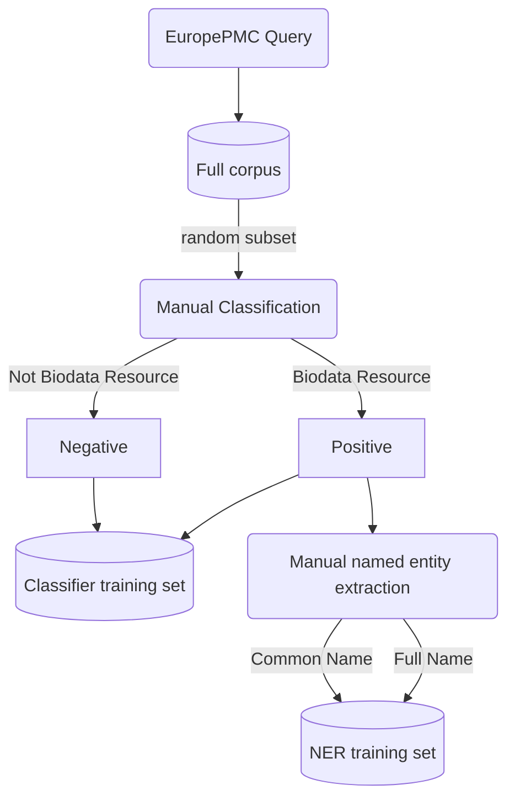
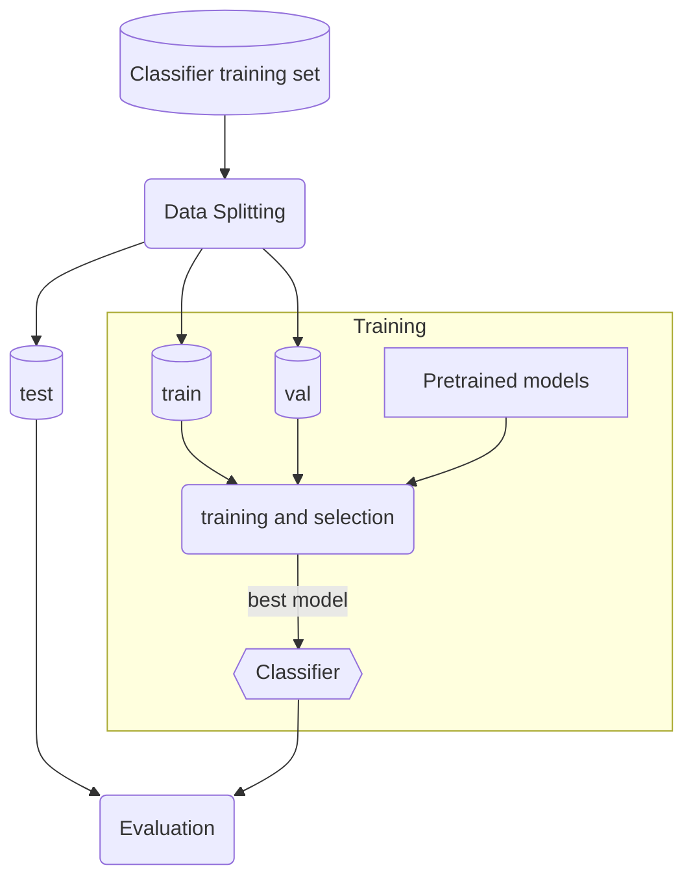
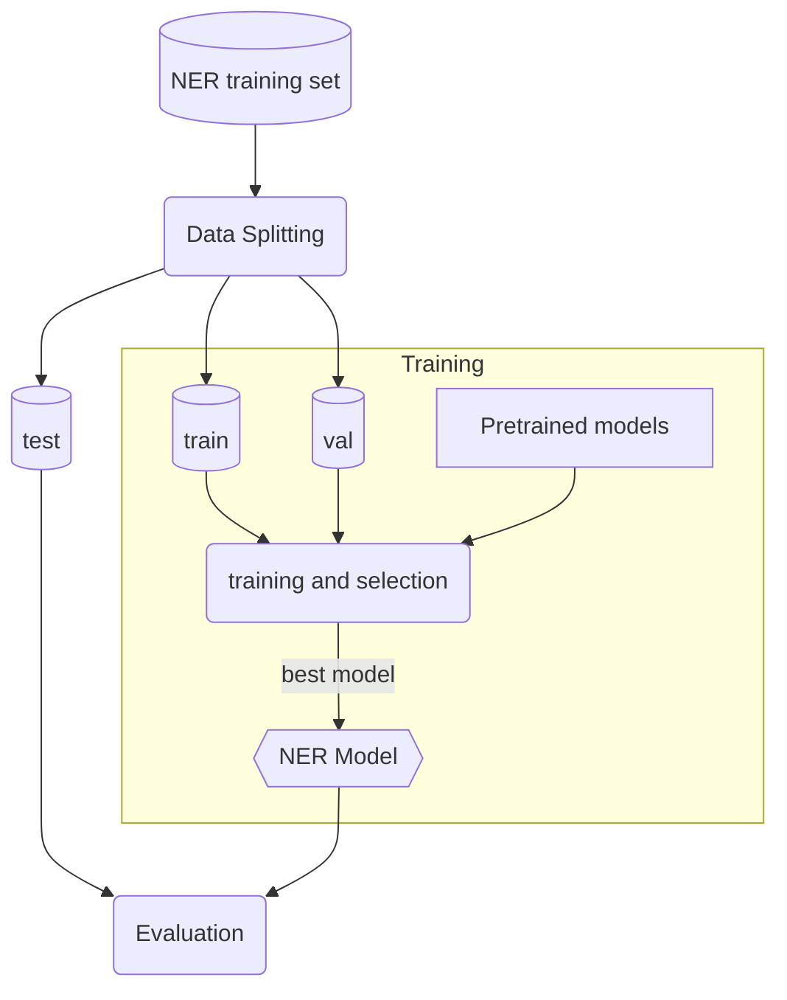
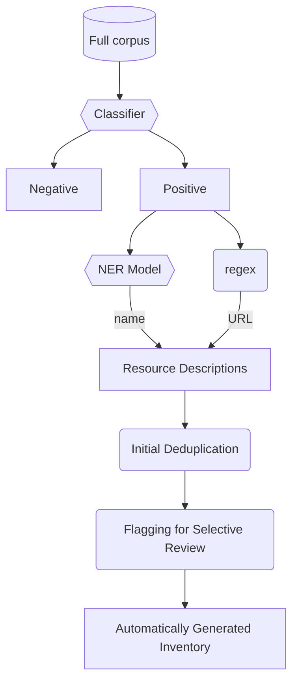
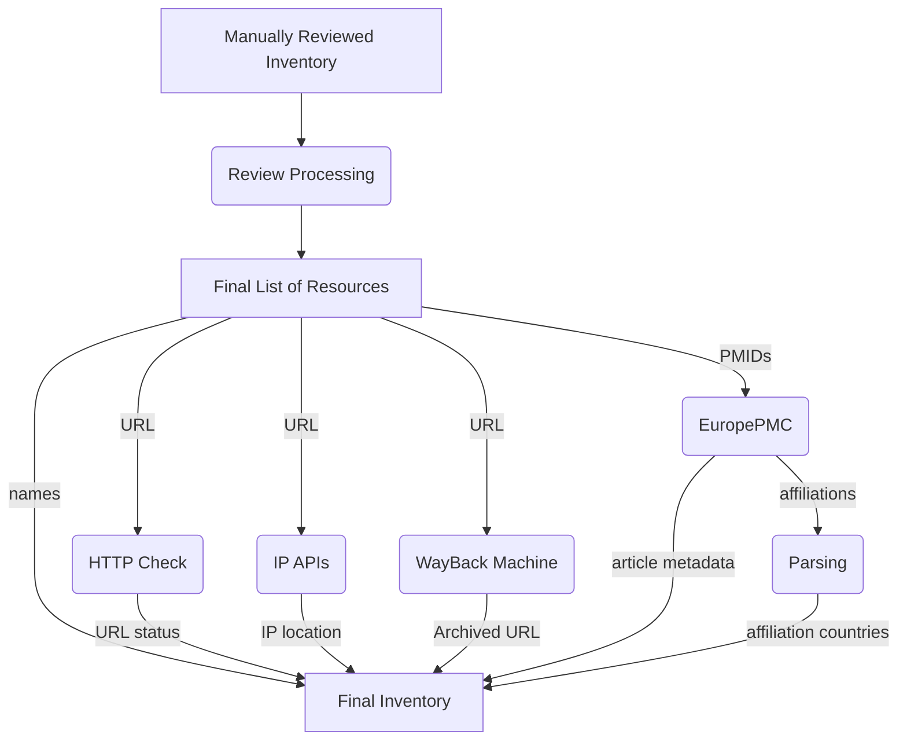

# GBC Inventory 2022

This code repository represents work done as part of a collaborative effort between the Chan Zuckerberg Initiative (CZI) and Global Biodata Coalition (GBC) to create an inventory of biodata resources found in scientific articles. CZI Research Scientist Ana-Maria Istrate designed the machine learning framework for the project and wrote the code to implement and evaluate the NLP models used to classify articles and extract individual resources. Ana’s code was used by GBC consultant Ken Schackart as the starting point for a pipeline to create an ML-predicted preliminary inventory, which is then further refined with code that includes steps for deduplication, processing for selective manual review, and augmentation with additional attributes to create the final inventory of biodata resources.

## Overview of Methods

EuropePMC is queried to obtain titles and abstracts of scientific articles. A BERT model is used to classify those articles as describing or not describing a biodata resource. A BERT model is also used to perform named entity recoginition to extract the resource name for those articles that are predicted to describe a biodata resource. Resource URLs are extracted using a regular expression.

This initial collection of articles is automatically deduplicated, and marked for selective manual review. A person manually reviews articles that are potential resource duplicates or false positives.

The manually reviewed inventory is processed to further deduplicate the inventory and remove false positives. The HTTP statuses of the extracted URLs is checked, the IP addresses of the URLs are geolocated, and archived versions of the URLs are checked in the Internet Archive's WayBack Machine. Further article metadata is obtained from EruopePMC.

The final inventory gives a list of biodata resources, the PMIDs of the articles describing those resources, and the metadata described above.

Snakemake is used as a workflow manager to automate these processes.

# Workflow overview

## Data curation

The manual curation has already been performed, using the full corpus obtained by querying EuropePMC. Titles and abstracts from ~1600 randomly selected papers were used for manual classification. This created the classifier training set. For those papers that were deemed to represent a biodata resource during manual curation, named entities were manually extracted from titles and abstracts, such as the reource name, URL, and description. This created the NER model training set.



## Classifier Training

The manually classified subset of the corpus is split into training, validation, and test (holdout) sets. Several pretrained BERT models are provided with the same training and validation data. The final classifier model is chosen based on the highest *F*1 score on the validation set. This is the classifier used in the final inventory. Final model performance is evaluated on the held-out test set.



## NER Model training

The set of manually extracted named entities is split into training, validation, and test (holdout) sets. Several pretrained BERT models are provided with the same training and validation data. The final NER model is chosen based on the highest *F*1 score on the validation set. This is the NER model used in the final inventory. Final model performance is evaluated on the held-out test set.



## Automated Inventory Generation

Once the classifier and NER models have been trained and selected, they are applied to the full corpus. Those papers that are classified as biodata resource by the trained classifier are passed to the trained NER model for extracting attributes of the resource such as resource common name and full name. Resource URLs are extracted using a regular expression

The predicted resources are automatically deduplicated (when the name and URL are the same), and the IDs of all articles describing resources are maintained.

The automatically generated inventory that has been deduplicated is flagged for selective manual review. Articles that share either the resource name or URL are marked as potential duplicates. Articles with low predicted name probability are maked for review.



## Selective Manual Review

The process up to this point is run without human intervention. As a quality control measure, the inventory must be manually reviewed for articles that are potentially duplicate descriptions of a common resource, or potential false positives based on a low name probability score.

During manual review, the inventory is annotated to determine which potential duplicates should be merged, and which low-probability articles should be removed.

## Final Processing

Once the automatically generated inventory has been manually reviewed, the directions given during manual review are exectued (further deduplication, removal of false resources). Further metadata is obtained from this finalized list of resources. HTTP status of associated URLs is assessed. Various APIs are queried to geolocated the IP address associated with the URLs. EuropePMC is queried to gather metadata on the articles describing the resources, such as the authors, author affiliations, funding agencies, grant IDs, and number of citations. The affiliations are parsed to extract the countries that are mentioned in the affiliations.



## Final Inventory Output

The finalized inventory has the following columns:

Column | Type | Description
:----: | :--: | -----------
ID | list(integer) | PMIDs associated with resource. IF multiple, they are separated by a comma and a space
best_name | string | Predicted name with highest probability
best_name_prob | float | Probability associated with the best name (out of 1.0)
best_common | string | Predicted common name with highest probability
best_common_prob | float | Probability associated with the best common name (out of 1.0)
best_full | string | Predicted full name with highest probability
best_full_prob | float | Probability associated with the best full name (out of 1.0)
extracted_url | string | URL(s) extracted from text
extracted_url_status | integer OR string | URL HTTP status code, or error string if an exception occured while requesting URL
extracted_url_country | string | Country code of IP address based on extracted URL, when available
extracted_url_coordinates | string | Country code of IP address based on extracted URL, when available. Formatted as (latitude, longitude)
wayback_url | string | Internet Archive's WayBack Machine's archived version of URL, when available
publication_date | string | Date of initial publication of newest article describing resource. Formatted as YYYY-MM-DD
affiliation | list(string) | Affiliation information from EuropePMC. Affiliation information from individual articles are joined with a space and a comma
authors | list(string) | Authors from EuropePMC. Author lists from individual articles are joined with a space and a comma.
grant_ids| list(string) | Grant IDs from EuropePMC. Author lists from individual articles are joined with a space and a comma.
grant_agencies | list(string) | Grant agencies from EuropePMC. Author lists from individual articles are joined with a space and a comma.
num_citations | integer | Number of citations for papers describing the resource
affiliation_countries | list(string) | Country codes of countries mentioned in affiliations

# Repository Structure

```sh
.
├── config/          # Workflow configuration files
├── data/            # Manual curation files and data splits
├── snakemake/       # Snakemake pipelines and rules
├── src/             # Python scripts and modules
├── .gitignore
├── LICENSE
├── Makefile         # Make targets for easy running of steps
├── README.md
├── requirements.txt
├── running_pipeline.ipynb
└── updating_inventory.ipynb
```

# Installation

There are several ways to install the dependencies for this workflow.

## Pip

If installing with pip, ensure you have Python version 3.8. Older or newer versions may not work.

```sh
$ python3 --version
Python 3.8.12
```

Then you can install Python dependencies using pip.

A make command is available for installing dependencies.

```sh
$ make setup
```

Alternatively, to install them manually:

```sh
$ pip install -r requirements.txt
```

Then download punkt:

```python
$ python3
>>> import nltk
>>> nltk.download('punkt')
```

## Anaconda

To create the environment in your `$HOME` directory, run:
```sh
$ conda env create -f config/environment.yml
$ conda activate inventory_env
```

Or you can create the environment in this repository by running:
```sh
$ conda env create -f config/environment.yml -p ./env
$ conda activate ./env
```

Then download punkt:

```python
$ python3
>>> import nltk
>>> nltk.download('punkt')
```

# Running Tests

A full test suite is included to help ensure that everything is running as expected. To run the full test suite, run:

```sh
$ make test
```

# Running the workflow

## Dry run

To see what steps would be run in the workflow, a dry run can be run:
```sh
$ make dryrun_reproduction
```

## Reproducing original results

To run the pipeline from a notebook in Colab, follow the steps in [running_pipeline.ipynb](running_pipeline.ipynb).

Alternatively, to run the pipeline from the command-line, run:
```sh
$ make train_and_predict
```

If Make is unavailable, run
```sh
$ snakemake -s snakemake/train_predict.smk --configfile config/train_predict.yml -c1
```

The above commands run the Snakemake pipeline. If you wish to run the steps manually, see [src/README.md](src/README.md#training-and-prediction).


## Updating the inventory

Before running the automated pipelines, first update the configuration file [config/update_inventory.yml](config/update_inventory.yml):

* **Europe PMC query publication date range**: These are stored as variables `query_from_date` and `query_to_date` in that file. Note that the dates are inclusive. For example to get papers published in 2022, both of those varibles should be 2022.
* **Previous inventory file**: During strict deduplication and flagging for manual review, the results of the previous inventory are taken into account. Specify the location of the most recent inventory output file in the variable `previous_inventory`.

To run the pipeline from a notebook in Colab, follow the steps in [updating_inventory.ipynb](updating_inventory.ipynb). To run from the command line, follow these steps.

First, make sure that the files specifying the best trained classifier and NER models are present at `out/classif_train_out/best/best_checkpt.txt` and `out/ner_train_out/best/best_checkpt.txt`. Those files specify which checkpoints to use. Check that the checkpoints those files point to are on your system.

If you do not have the trained models, and do not want to perform training, they can be downloaded with:
```sh
# Add code here for getting models!
```

Next, **make sure that output from previous updates have been saved elsewhere, as the old results must be deleted**. For example

```sh
$ mv out/new_query out/update_2022
```


To remove the outputs of previous run:
```sh
$ rm -rf out/new_query
```

Then the pipeline for updating results can be run:
```sh
$ make update_inventory
```

If Make is unavailable, run
```sh
$ snakemake -s snakemake/update_inventory.smk --configfile config/update_inventory.yml -c1
```

The above commands run the Snakemake pipeline. If you wish to run the steps manually, see [src/README.md](src/README.md#updating-the-inventory).

## Adjusting configurations

The Snakemake pipelines are built such that they capture the workflow logic, while all configurations are stored separately. This makes it possible to adjust the workflows without changing source code or the Snakemake pipelines.

Configurations for reproducing original results are in [config/train_predict.yml](config/train_predict.yml) such as train/validation/split ratios and output directories. Configurations for updating the inventory are in [config/update_inventory.yml](config/update_inventory.yml).

Configurations regarding model training parameters are stored in [config/models_info.tsv](config/models_info.tsv), such as number of epochs, and convenient model names as well as official HuggingFace model names.

The EuropePMC query string is stored in [config/query.txt](config/query.txt).

# How to Cite


# Authorship

* [Dr. Heidi Imker](hjimker@gmail.com), Global Biodata Coalition
* [Kenneth Schackart](schackartk1@gmail.com), Global Biodata Coalition
* [Ana-Maria Istrate](aistrate@chanzuckerberg.com), Chan Zuckerberg Initiative
