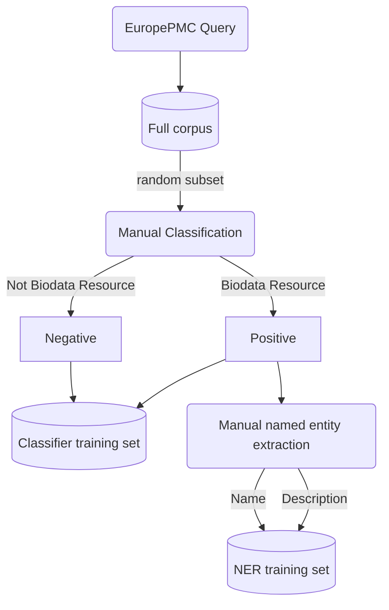
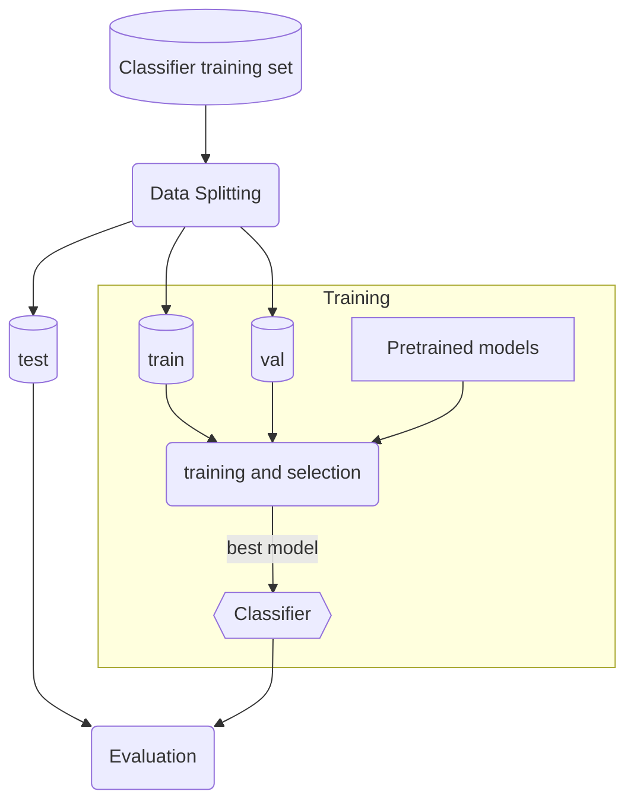
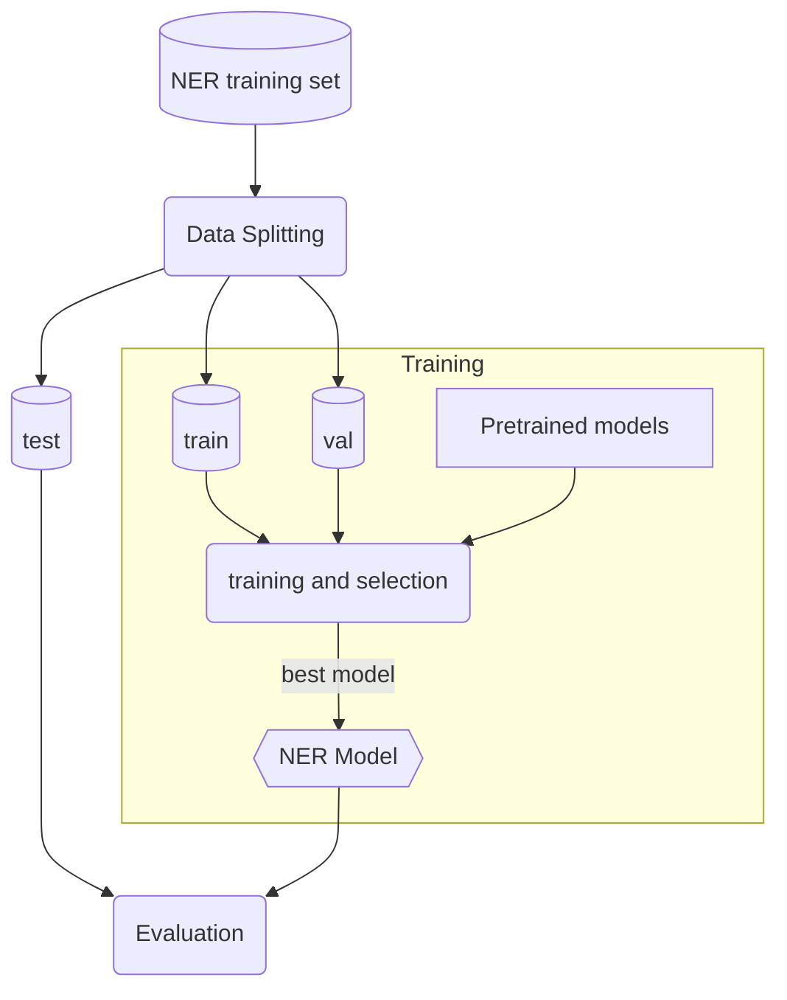
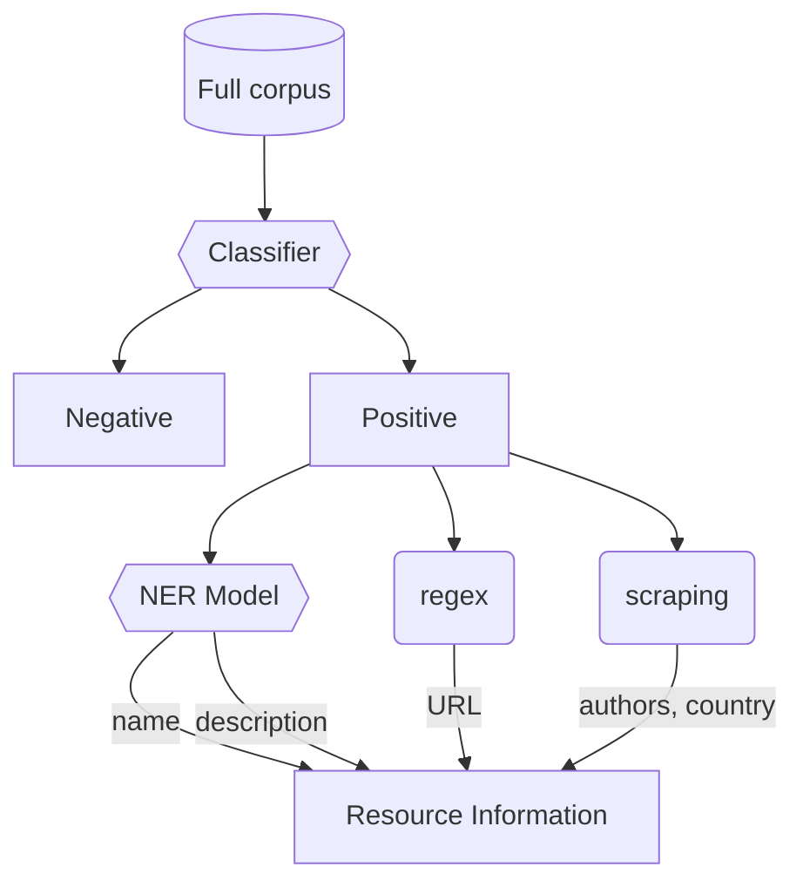

# inventory_2022 (Work in Progress)

Public repository for the biodata resource inventory performed in 2022.

# Workflow overview

## Data curation

The manual curation has already been performed, using the full corpus obtained by querying EuropePMC. Titles and abstracts from ~1600 randomly selected papers were used for manual classification. This created the classifier training set. For those papers that were deemed to represent a biodata resource during manual curation, named entities were manually extracted from titles and abstracts, such as the reource name, URL, and description. This created the NER model training set.



## Classifier Training

The manually classified subset of the corpus is split into training, validation, and test (holdout) sets. Several pretrained BERT models are provided with the same training and validation data. The final classifier model is chosen based on the highest *F*1 score on the validation set. This is the classifier used in the final inventory. Final model performance is evaluated on the held-out test set.



## NER Model training

The set of manually extracted named entities is split into training, validation, and test (holdout) sets. Several pretrained BERT models are provided with the same training and validation data. The final NER model is chosen based on the highest *F*1 score on the validation set. This is the NER model used in the final inventory. Final model performance is evaluated on the held-out test set.



## Inventory

Once the classifier and NER models have been trained and selected, they are applied to the full corpus. Those papers that are classified as biodata resource by the trained classifier are passed to the trained NER model for extracting attributes of the resource such as resource name and description. Other scripts will be used to glean other information, such as resource URLs, authors, country of origin, etc.



# Repository Structure

```
.
├── config/          # Workflow configuration files
├── data/            # Manual curation files and data splits
├── src/             # Python scripts
├── tests/           # pytest scripts
├── .gitignore
├── LICENSE
├── Makefile         # Make targets for easy running of steps
├── README.md
├── requirements.txt
├── running_pipeline.ipynb
├── train_predict.smk
├── update_inventory.smk
└── updating_inventory.ipynb
```

# Installation

There are several ways to install the dependencies for this workflow.

## Anaconda (recommended)

To create the environment in your `$HOME` directory, run:
```
$ conda env create -f config/environment.yml
$ conda activate inventory_env
```

Or you can create the environment in this repository by running:
```
$ conda env create -f config/environment.yml -p ./env
$ conda activate ./env
```

## Pip

If installing with pip, ensure you have Python version 3.8. Older or newer versions may not work.

```
$ python3 --version
Python 3.8.12
```

Then you can install Python dependencies using pip

```
$ pip install -r requirements.txt
```

# Running Tests

A full test suite is included to help ensure that everything is running as expected. To run the full test suite, run:

```
make test
```

# Running the workflow

## Dry run

To see what steps would be run in the workflow, a dry run can be run:
```
make dryrun_reproduction
```

## Reproducing original results

To run the pipeline from a notebook in Colab, follow the steps in [running_pipeline.ipynb](running_pipeline.ipynb).

Alternatively, to run the pipeline from the command-line, run:
```
make train_and_predict
```

## Updating the inventory

To run the pipeline from a notebook in Colab, follow the steps in [updating_inventory.ipynb](updating_inventory.ipynb). To run from the command line, follow these steps.

First, make sure that the trained classifier and NER models are present at `out/classif_train_out/best/*/best_checkpt.pt` and `out/ner_train_out/best/*/best_checkpt.pt`.

If you do not have trained models, and do not want to perform training, they can be downloaded with:
```
# Add code here for getting models!
```

Next, **make sure that output from previous updates have been saved elsewhere, as the old results must be deleted**.

To remove the outputs of previous run:
```
rm data/new_query_results.csv
rm -rf data/new_paper_predictions/
```

Then the pipeline for updating results can be run:
```
make update_inventory
```


# Authorship

* [Dr. Heidi Imker](hjimker@gmail.com), Global Biodata Coalition
* [Kenneth Schackart](schackartk1@gmail.com), Global Biodata Coalition
* [Ana-Maria Istrate](aistrate@chanzuckerberg.com), Chan Zuckerberg Initiative
